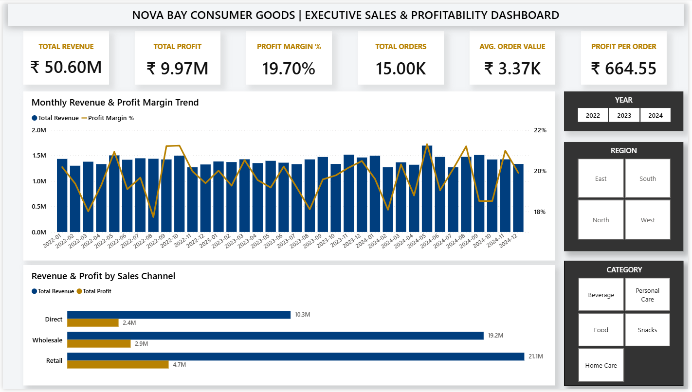
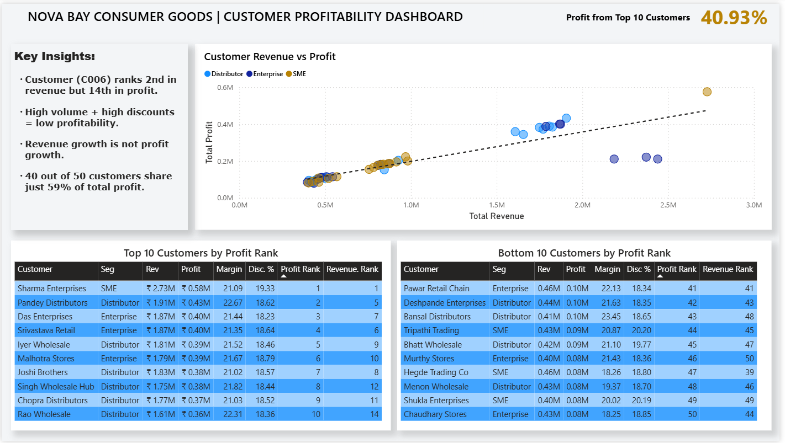
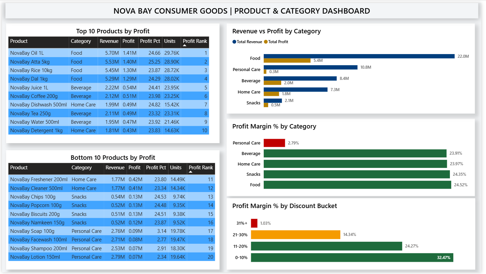
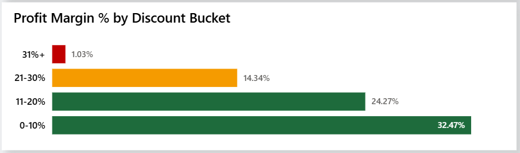
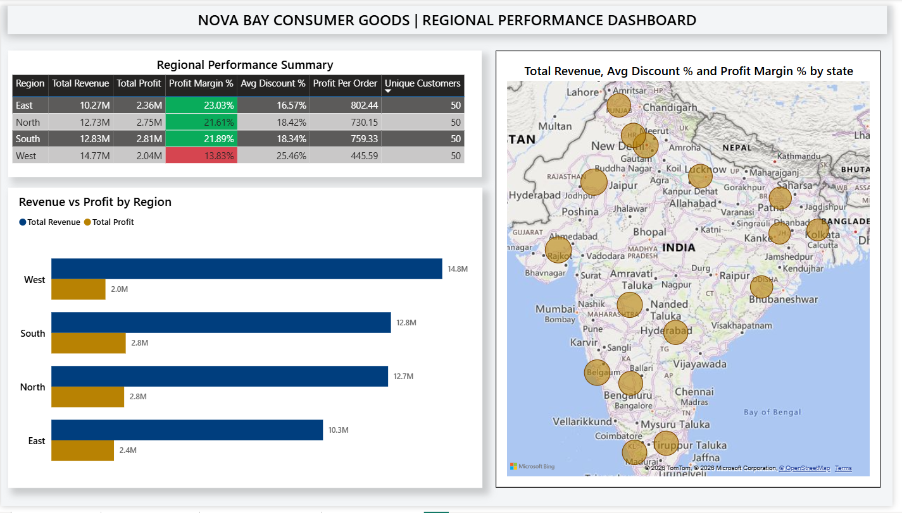

<div align="center">

# Retail Profitability Dashboard

**SQL + Power BI | NovaBay Consumer Goods**

Analyzing ₹50.60M in revenue across 15,000 transactions to find where the business is actually making money — and where revenue growth is hiding a profitability problem.


</div>

---

## The Short Version

NovaBay Consumer Goods tracks ₹50.60M in revenue across 4 regions, 5 product categories, and 3 sales channels. The numbers look healthy. But underneath the revenue, three serious problems are hiding.

The West region generates the highest revenue but has the lowest profit margin. One product category is barely breaking even despite strong sales. And the company's top revenue customers are not its top profit customers.

This dashboard makes all three problems visible — and points to exactly where the fixes should go.

---

## The Core Problem

Revenue and profit are not the same thing. A business can grow its top line while quietly destroying its bottom line through excessive discounts, high freight costs, and inefficient channel spending.

NovaBay has all three problems — and without a clear view of profitability by customer, category, region, and channel, leadership cannot tell which parts of the business are actually worth investing in.

This dashboard makes profitability visible across customers, categories, regions, and channels.

---

## Dashboard Preview



---

## Key Business Insights

**Insight 1 — Top revenue customers are not top profit customers**

The top 3 revenue customers — Reddy Supermart, Mehta Retail Chain, and Verma Retail Ltd — rank 14th, 13th, and 15th in profit respectively. They generate high order volumes but their revenue rankings and profit rankings are completely misaligned.

The reason is excessive discounts. These customers receive 30-40% discount on their orders, which means NovaBay is generating revenue at almost no margin. Top 10 customers by profit control 40.93% of all profit — and they are a completely different group from the top 10 by revenue.

**Insight 2 — Personal Care category is a margin problem**

Personal Care generates ₹10.79M in revenue — the second highest of any category. But its profit margin is just 2.79% vs 23-24% for every other category. High freight costs (₹1.66M total) combined with high cost of goods mean NovaBay earns almost nothing from Personal Care despite strong sales volume.

**Insight 3 — West region: highest revenue, lowest margin**

West generates ₹14.77M — more than any other region. But its profit margin is 13.83% vs 21-23% for other regions. The driver is discount pressure — West customers receive an average 25.46% discount vs 16-18% in other regions. Higher sales volume without corresponding profitability.

**Insight 4 — High discounts destroy margin**

Orders with 0-10% discount deliver 32.47% profit margin. Orders with 31%+ discount deliver just 1.03% margin. Every percentage point of discount above 20% removes disproportionate profit. The 31%+ bucket has 2,742 transactions — each one nearly profitless.

**Insight 5 — Direct channel is the most efficient**

Direct channel delivers ₹802 profit per order vs ₹483 for Wholesale and ₹781 for Retail. Wholesale has the highest volume but the lowest margin at 15.22% — driven by the heavy discounts given to wholesale customers (avg 24.35%).

---

## Business Recommendations

**1. Cap discounts in the West region**

West region customers are receiving avg 25.46% discount — nearly 10 points above other regions. Reducing West discounts toward the 18-20% range could meaningfully close the gap between West margin (13.83%) and the company average (19.70%). The exact recovery would depend on customer retention and pricing response — but the direction is clear.

**2. Review Personal Care freight or pricing**

Personal Care freight costs total ₹1.66M — significantly higher than other categories relative to the profit generated. Either freight needs to be renegotiated with logistics partners, or Personal Care pricing needs to be increased to absorb the cost. Leaving 2.79% margin on a ₹10.79M revenue category is not sustainable long term.

**3. Set a hard cap on 31%+ discounts**

2,742 transactions carry 31%+ discount — generating just 1.03% margin. These orders consume sales effort while contributing almost no profit. A hard cap at 30% maximum discount across all channels would eliminate the lowest-margin transactions without affecting the majority of orders.

**4. Shift investment toward the Direct channel**

Direct channel delivers ₹802 profit per order vs ₹483 for Wholesale — a 66% gap. Growing Direct channel volume while reducing Wholesale dependence would improve overall company margin without requiring new customer acquisition.

---

## Dashboard Pages

**Page 1 — Executive Overview**

Six KPI cards show the full business picture at a glance — Total Revenue, Total Profit, Profit Margin %, Total Orders, Avg Order Value, and Profit Per Order. A combo chart tracks monthly revenue and profit margin trend across 36 months. A channel comparison bar shows revenue and profit side by side for Direct, Wholesale, and Retail. Three slicers — Year, Region, Category — filter all fact_sales-based visuals on this page.

**Page 2 — Customer Profitability**

A scatter chart plots every customer by Total Revenue (X axis) vs Total Profit (Y axis). Customers in the bottom-right quadrant show high revenue but low profit — highlighting inefficient pricing or discounting. Two ranked tables show the Top 10 and Bottom 10 customers by profit with revenue rank alongside for direct comparison. The ranking tables show overall standings and are not affected by page slicers by design.



**Page 3 — Product, Category & Discount Analysis**

Top section shows category-level margin — Personal Care's red bar at 2.79% stands out immediately against the green bars of all other categories at 23-24%. Bottom section shows the top and bottom 10 products by profit. A traffic-light discount bucket chart shows how margin collapses as discount level increases — from 32.47% at 0-10% down to 1.03% at 31%+.

**Category & Product View**



**Discount Impact**



**Page 4 — Regional Performance**

A summary table shows all 4 regions with conditional formatting on margin — West in red at 13.83%, all others in green. A side-by-side bar chart makes the revenue-profit gap visible for each region. An India map shows state-level revenue distribution across all 16 states.



---

## What the Numbers Show

| Metric | Value |
|---|---|
| Total Revenue | ₹50.60M |
| Total Profit | ₹9.97M |
| Overall Profit Margin | 19.70% |
| Total Orders | 15,000 |
| Worst Region (Margin) | West — 13.83% |
| Best Region (Margin) | East — 23.03% |
| Worst Category (Margin) | Personal Care — 2.79% |
| Worst Discount Bucket | 31%+ — 1.03% margin |
| Top 10 Customer Profit Share | 40.93% of total profit |

---

## SQL Approach

The analysis uses a two-stage SQL pipeline across 7 structured files.

**Stage 1 — Prepare (Files 01-03)**

Raw CSV data is imported into `sales_raw`. All 9 validation checks run on the raw data — null checks, negative value checks, discount range validation, profit formula verification. Once clean, `fact_sales` is created with 5 additional derived columns: discount_bucket, profit_margin_pct, order_year, order_month, and order_year_month.

**Stage 2 — Analyze (Files 04-07)**

Six views are built from `fact_sales` — customer profitability with CTE-based ranking, category and product margin analysis, regional performance at state level, discount impact by bucket, and channel efficiency with revenue and profit share percentages.

All business logic lives in SQL. DAX handles presentation and time intelligence only.

---

## Power BI Model

| Component | Detail |
|---|---|
| Fact Table | `fact_sales` — 15,000 rows, all DAX measures run from here |
| Date Dimension | `dim_date` — CALENDAR 2022-2024, marked as Date Table |
| Relationship | `fact_sales[order_date]` → `dim_date[Date]` — Many to One |
| Summary Views | 6 disconnected views used for overall ranking tables and supporting analysis |
| Slicer Design | Charts built from fact_sales are fully slicer-responsive. Ranking tables from summary views show overall standings and are intentionally static. |

---

## DAX Measures

| Measure | Formula |
|---|---|
| Total Revenue | SUM(fact_sales[revenue]) |
| Total Profit | SUM(fact_sales[profit]) |
| Total Orders | DISTINCTCOUNT(fact_sales[order_id]) |
| Profit Margin % | DIVIDE([Total Profit], [Total Revenue], 0) * 100 |
| Avg Order Value | DIVIDE([Total Revenue], [Total Orders], 0) |
| Profit Per Order | DIVIDE([Total Profit], [Total Orders], 0) |
| Avg Discount % | AVERAGE(fact_sales[discount_pct]) * 100 |
| MoM Profit Growth % | DATEADD time intelligence on dim_date |
| YTD Revenue | TOTALYTD([Total Revenue], dim_date[Date]) |
| YTD Profit | TOTALYTD([Total Profit], dim_date[Date]) |
| Top 10 Profit Share % | DIVIDE(SUMX(FILTER(vw_customer_profitability, [is_top10_profit] = 1), [total_profit]), SUM(vw_customer_profitability[total_profit]), 0) * 100 |

---

## Dataset

**Company:** NovaBay Consumer Goods Pvt. Ltd. — a fictional mid-sized FMCG company selling across 4 regions in India through Retail, Wholesale, and Direct channels.

**Data grain:** Each row represents one order line item. One order can contain multiple products and therefore multiple rows.

| Detail | Info |
|---|---|
| File | data/raw/novabay_sales_data.csv |
| Rows | 15,000 order line items |
| Period | January 2022 – December 2024 |
| Customers | 50 unique customers |
| Products | 20 products across 5 categories |
| Regions | North, South, East, West |
| States | 16 Indian states |

**About the data:** This dataset is synthetic, generated to reflect realistic FMCG sales behavior — including margin pressure from freight costs, profitability loss from high discounts, and efficiency differences across sales channels. The patterns are intentional and based on real business dynamics, not random noise. Numeric recommendations should be treated as directional, not financial forecasts.

---

## Limitations

- This is pattern analysis, not prediction. The dashboard identifies where problems exist — not which specific orders or customers will behave differently in future.
- The dataset is synthetic. All figures are illustrative. Recommendations are directional — not financial forecasts.
- Ranking tables (Top 10 / Bottom 10) show overall standings and are intentionally not affected by page slicers.

---

## How to Run This

**Step 1 — Generate the dataset**
```bash
cd generator
pip install -r requirements.txt
python generate_novabay_data.py
```
This creates `data/raw/novabay_sales_data.csv`

**Step 2 — Set up MySQL**
- Open MySQL Workbench
- Run `sql/01_database_setup.sql` — creates database and table
- Import the CSV using MySQL Workbench Table Data Import Wizard into `sales_raw`
- If MySQL blocks local file import, enable it: `SET GLOBAL local_infile = 1;`
- Run `sql/02_validation_checks.sql` — verify all 9 checks pass before continuing
- Run `sql/03_create_fact_sales.sql` — creates the cleaned analysis table
- Run `sql/04` through `sql/07` — creates all 6 views

**Step 3 — Open Power BI**
- Open `powerbi/novabay_dashboard.pbix`
- Update MySQL connection credentials if prompted (host: localhost, database: novabay_db)
- Click Refresh — all 7 tables reload from MySQL

---

## Project Structure

```
retail-profitability-dashboard/
│
├── data/
│   ├── raw/
│   │   └── novabay_sales_data.csv
│   └── processed/
│
├── sql/
│   ├── 01_database_setup.sql
│   ├── 02_validation_checks.sql
│   ├── 03_create_fact_sales.sql
│   ├── 04_views_customer_analysis.sql
│   ├── 05_views_product_analysis.sql
│   ├── 06_views_regional_analysis.sql
│   └── 07_views_discount_channel.sql
│
├── powerbi/
│   └── novabay_dashboard.pbix
│
├── images/
│   ├── dashboard_overview.png
│   ├── customer_profitability.png
│   ├── product_category_analysis.png
│   ├── regional_performance.png
│   └── discount_analysis.png
│
├── generator/
│   └── generate_novabay_data.py
│
├── README.md
└── requirements.txt
```

---

## Author

**Ashish Kumar Dongre**

[LinkedIn](https://www.linkedin.com/in/analytics-ashish/) &nbsp;|&nbsp; [GitHub](https://github.com/analytics-ak)
